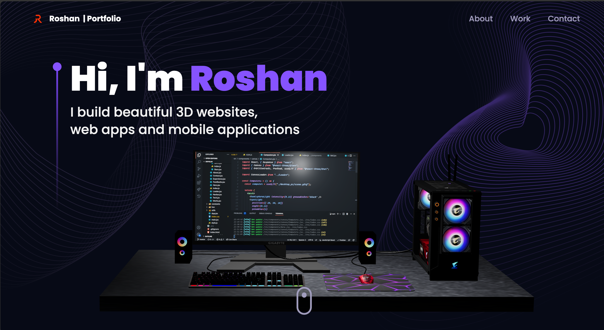

# Roshan's 3D Portfolio


[Website - Roshan's Portfolio](https://roshanjose7.github.io/)

## Tech Stack

- ReactJS - a popular JavaScript library for building user interfaces
- ThreeJS - a powerful 3D graphics library for rendering and animating the 3D model
- React Three Fiber - a popular library for creating 3D graphics with ThreeJS in React
- TailwindCSS - a popular utility-first CSS styling framework
- Framer Motion - the most popular library used to bring your React website to life with animations

## Run Locally

Clone the project

```bash
  git clone
```

Go to the project directory

```bash
  cd roshanjose7.github.io
```

Install dependencies

```bash
  npm install
```

Start the server

```bash
  npm run start
```
